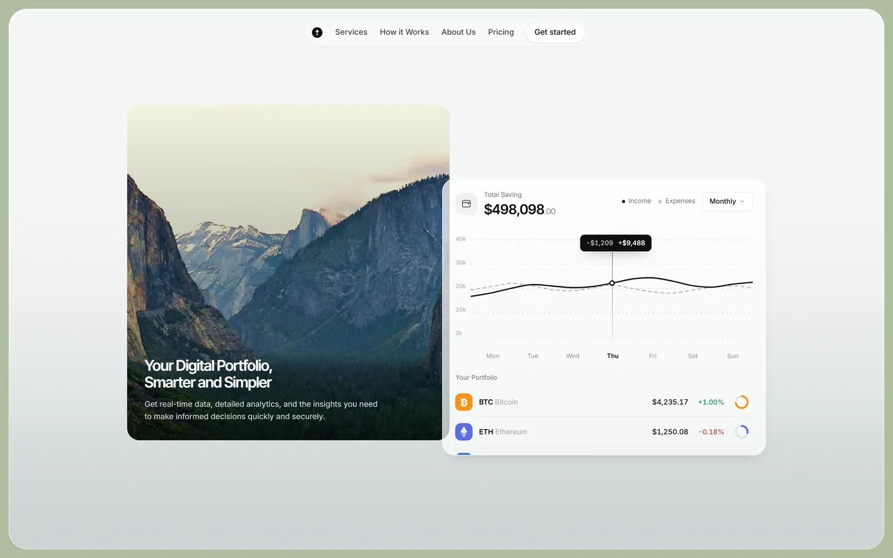
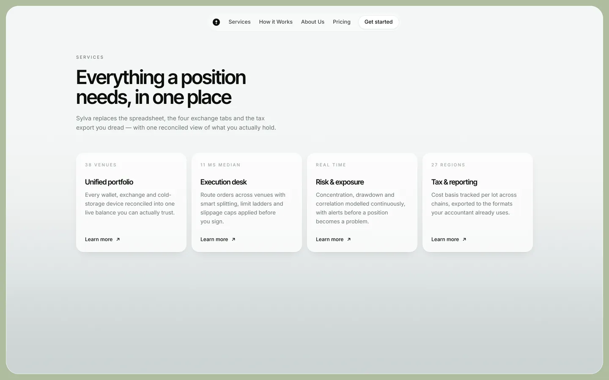
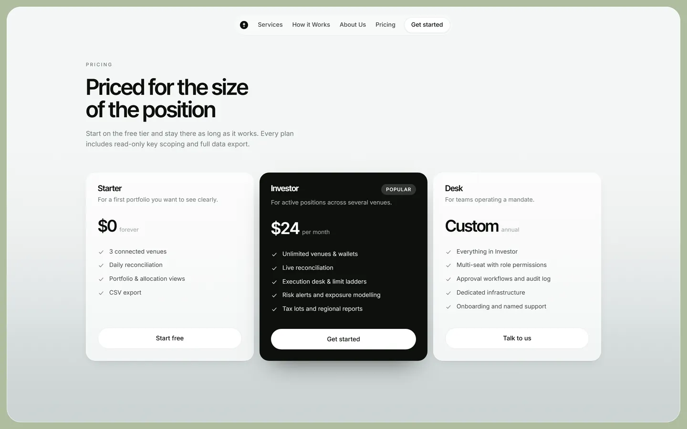
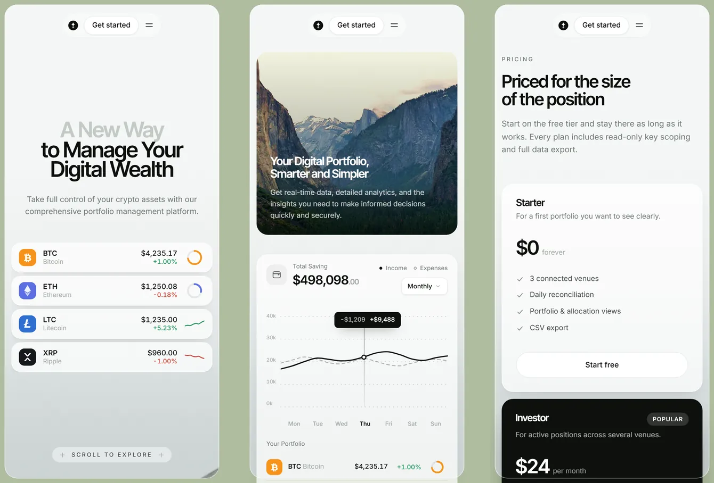

# Sylva — crypto portfolio landing page

A marketing page for a fictional crypto portfolio platform, rebuilt shot-for-shot
from a ten-second motion reference: the blur-in headline, the pill that unfolds
into a live asset list, the moss creeping along a fallen limb, and the
dissolve into a floating analytics dashboard.

**[→ Live demo](https://tranqww.github.io/sylva-landing/)**


---

## What this is

The brief was a single reference clip — no design file, no assets, no copy
beyond what was legible on screen. Everything here was reconstructed from it:
the colour values were sampled out of the video frames, the layout proportions
measured off them, and the two hero limbs were built from scratch because a
photograph of the right branch, lit the right way, cut out against white, does
not exist.

The reference only shows two screens. Those two are reproduced closely; the
rest of the page (services, process, pricing, footer) extends the same visual
and motion language so the navigation actually leads somewhere.

## Highlights

### The hero limbs are composited, not photographed

`scripts/build_assets.py` generates them. Given a lichen bark photograph and a
moss photograph, it:

- sweeps a tapering silhouette along a Catmull-style centreline and displaces
  its edge with two bands of fractal value noise — broad for the profile, tight
  for bark flake
- maps the bark along the branch axis with bilinear, mirror-tiled sampling
  (point sampling a 2500 px photo into a 1200 px footprint aliases into
  vertical streaks; mirror tiling hides the repeat seam)
- shades it as a cylinder — a `sqrt(1 - u²)` volume term, a key light from
  above, a specular band on the upper face and a contact shadow along the belly
- grows moss on the upward face through layered patch and grain masks, letting
  it creep a little past the bark silhouette so the outline stays soft
- dissolves the far end into the same haze the page gradient ends on, so the
  limb can end mid-frame without showing a seam

Bark and moss are emitted as two aligned RGBA layers, which is what lets the
moss be revealed independently of the bark.

### The moss is painted by the cursor

Tracking the reference frame by frame shows the moss growth front following the
pointer — right, then back left, then right again — rather than sweeping one
way, and moss that has appeared never disappears. A CSS mask cannot express
that, so the moss layer is a canvas: an offscreen buffer accumulates soft
radial blobs along the pointer path, and the moss bitmap is composited against
it with `destination-in`.

Mapping a viewport pointer position into a rotated limb's own space is
closed-form rather than a matrix walk — every transform on the limb is one we
applied ourselves, so `toLimbSpace` just undoes the translate, rotation, scale
and mirror in turn. The base rotation is set through the standalone CSS
`rotate` property so GSAP's `x`/`y` writes to `transform` cannot clobber it.

A slow base pass grows moss on load regardless, so the page is never bare
before the visitor moves anything, and coarse-pointer devices — which never
send a `pointermove` — get the full reveal outright.

```bash
npm run assets   # re-downloads the sources and recomposites everything
```

### One motion system, four beats

| Beat | What happens |
| --- | --- |
| Load | A bare limb sweeps up into frame from the lower left — sharp and opaque, no fade — then a base pass of moss starts growing along it while a second limb arrives behind; nav, headline lines, sub-copy and pill stagger in over the top |
| Pointer | **The moss is painted by the cursor.** Move it across a limb and moss grows under it, permanently. The limbs also lean toward the pointer, near limb further than far, with a subtle 3D tilt on the whole scene |
| Idle | The portfolio pill unfolds — it cross-fades out while four asset rows stagger up through a blur and the container animates to its measured height |
| Hand-off | Scrolling dissolves the hero instead of scrolling it: copy drifts up and blurs out, limbs push down, grow and defocus |
| Reveal | The photo panel and dashboard arrive from opposite directions, then the chart draws — grid, dashed expenses, solid income, marker, tooltip |

Lenis is driven from GSAP's ticker so smooth scrolling and every ScrollTrigger
share one clock. `prefers-reduced-motion: reduce` skips every timeline and
renders the finished state directly — including auto-expanding the portfolio,
so no content is only reachable through an animation.

### Everything is drawn, nothing is an image

The chart, sparklines, rings, coin marks and logo are inline SVG. The line
reveals use an animated clip rect rather than `DrawSVGPlugin`, because DrawSVG
owns `stroke-dasharray` and would flatten the dashed expenses series and the
dotted gridlines into solid strokes.

## Screenshots

| Portfolio section | Services |
| --- | --- |
|  |  |





## Stack

| | |
| --- | --- |
| Framework | React 19 + TypeScript, Vite 8 |
| Styling | Tailwind CSS 4 (CSS-first `@theme` tokens) |
| Motion | GSAP 3 (ScrollTrigger, CustomEase) + Lenis |
| Type | Inter Tight / Inter, variable, latin subset only, self-hosted |
| Asset pipeline | Python 3 + Pillow + NumPy |
| Visual QA | Playwright |

Shipped weight: **~124 kB gzipped** of JS, ~8.5 kB of CSS, ~93 kB of font,
~0.65 MB of imagery. No analytics, no trackers, no runtime network calls.

## Running it

```bash
cd app
npm install
npm run dev          # http://localhost:5173
```

Other tasks:

```bash
npm run build        # typecheck + production build
npm run preview      # serve the build
npm run typecheck
npm run lint
npm run assets       # regenerate public/assets from the source photographs
npm run shots        # Playwright capture of every section, desktop + mobile
```

`npm run assets` needs Python 3 with `pillow` and `numpy`. It caches the
downloads in `app/scripts/.cache/`, so re-runs are offline.

### Deploying

The build takes its base path from `VITE_BASE`, so it works at the domain root
or under a project-site subpath:

```bash
npm run deploy -- --remote origin --base /sylva-landing/
```

That builds with the given base, then force-pushes `dist/` to an orphan
`gh-pages` branch through a temporary worktree — the branch stays a single
commit and the working tree is never touched.

## Layout

```
app/
├─ public/assets/          generated — branch layers, moss layers, valley photo
├─ scripts/
│  ├─ build_assets.py      the branch compositor and photo pipeline
│  ├─ deploy-pages.mjs     orphan-branch deploy to GitHub Pages
│  └─ shoot.mjs            Playwright visual capture
└─ src/
   ├─ components/
   │  ├─ Frame.tsx         the rounded screen the page floats inside
   │  ├─ BranchScene.tsx   limb placement, intro timeline, scroll hand-off
   │  ├─ Hero.tsx          headline, sub-copy, scroll cue, hero timeline
   │  ├─ PortfolioMorph.tsx the pill → asset list unfold
   │  ├─ Showcase.tsx      photo panel + dashboard composition
   │  ├─ Dashboard.tsx     total, legend, holdings
   │  ├─ SavingsChart.tsx  the drawn chart
   │  ├─ Charts.tsx        rings, segment ring, sparklines
   │  ├─ Sections.tsx      services, process, pricing, CTA, footer
   │  └─ Reveal.tsx        the shared scroll reveal
   ├─ lib/
   │  ├─ motion.ts         GSAP setup, the two eases, reduced-motion probe
   │  ├─ useSmoothScroll.ts Lenis on GSAP's ticker
   │  └─ curve.ts          Catmull-Rom → cubic bezier
   └─ styles/index.css     tokens, base, utilities, the moss mask
```

## Accessibility

- Every animated element has a resting state that is reachable without motion;
  `prefers-reduced-motion` short-circuits all four timelines.
- Skip link, visible focus rings, `aria-expanded` on both disclosures, and the
  expanded portfolio exposes a keyboard-reachable collapse control.
- Nav is a real `<nav>` with a list; the mobile menu closes on `Escape`.
- The decorative limb layer is `aria-hidden` and `pointer-events-none`; the one
  content image carries a real description.
- Headings run `h1 → h2 → h3` with no skipped levels.

## Licence and credits

Code is MIT (see [LICENSE](LICENSE)). The three photographs are CC BY / CC BY-SA
and keep their own terms — full credit in [ATTRIBUTIONS.md](ATTRIBUTIONS.md).

**Sylva is not a real product.** Every price, percentage and balance on the page
is invented. Nothing here is a financial product, an offer, or advice.
